# 🪴 career-WBS

> mermaid로 작성된 과제는 마크다운 파일(WBS.md)로 올려주시면 됩니다. (md 파일 내에 기존 구조를 넣어주세요)  
> 별도 아키택쳐나 모델링 도구를 사용한 경우에는 마크다운 파일(WBS.md)과 png, gif, jpg, pdf 파일 형식으로 WBS-{gitID}.png 파일명으로 upload 해주세요

# 요구사항

-   [x] 개선하려는 프로젝트의 최종 설계
    -   [x] 변경 사항에 대한 Target 시스템 설계를 확정한다. (3주차 미션 활용)
    -   [x] 변경 사항에 대한 기대효과를 확정한다. (3주차 미션 활용)
-   [ ] task list 도출
    -   [ ] 현 시스템에서 변경되는 부분을 class diagram(DB변경이 발생할 경우 ERD추가)으로 작성
    -   [ ] 변경, 추가 될 프로그램들의 작업 목록을 작성한다.
-   [ ] 일정 계획 문서 (WBS)
    -   [ ] 작업목록의 소요일정을 산정 한다.
    -   [ ] 작업 목록의 의존성을 정의 한다.
    -   [ ] 작업 목록의 전체 일정을 작성한다.
    -   [ ] 진행 상태를 check하기위한 마일스톤 설정 한다.

# 🚀미션

## AS-IS

### AS-IS 개선포인트 분석

-   운영 이슈 티켓으로 제일 많이 올라오는 건이 운임비 수정 건입니다. 하루에 올라오는 운영 이슈 중 50% 비율을 차지하고 있습니다.
-   해당 이슈가 티켓으로 올라오면 전표가 발행된 주문인지 확인합니다.
-   전표가 발행된 주문은 전표 취소 API를 통해서 전표를 취소합니다.
-   전표가 발행되지 않은 주문은 DB 데이터를 수동으로 수정합니다.
-   이렇게 수동으로 수정하는 작업이 주문의 개수에 따라 많게는 30분까지 걸립니다.
-   이렇게 리소스가 많이 드는 작업을 API를 통해 어드민 페이지에서 기능을 제공하거나 테스트 코드를 만들면 비용을 많이 줄일 수 있으 것으로 예상됩니다.

### AS-IS 프로세스

```mermaid
flowchart TB
    A[Start] --운임비수정요청--> B(전표발행확인)
    B -- 전표발행완료 --> C[전표취소요청/w.API]
    B -- 전표발행안됨 --> D[DB데이터보정]
```

### Class diagram

-   AS-IS 구조에서 개선을 할때 영향을 받게되는 class diagram을 작성한다.

```mermaid
classDiagram

    class PaymentMethod {
        +String paymentMethodID
        pay()
        cancel()
    }
    PaymentMethod <|-- Card
    PaymentMethod <|-- Bank

    class PG {
        +String pgID
        pay()
        cancel()
    }
    PG <|-- Card
    PG <|-- Bank


    class Payment {
        +String paymentID
        +String transactionID
        void pay()
    }

    class Cancel {
        +String cancelID
        +PaymentID paymentID
        +String transactionID
        void cancel()
    }

    class CancelDetail {
        +String cancelDetailID
        +String cancelID
    }

    class PaymentDetail {
        +PaymentID paymentID
    }


    class Card {
        CardID
        pay()
        cancel()
        checkTransaction()
    }
    note for Card "checkTransaction() : 결제내역확인"

    class Bank {
        BankID
        pay()
        cancel()
        checkTransaction()
    }
    note for Bank "checkTransaction() : 결제내역확인"

   Payment "1" -- "*" PaymentDetail : 결제수단, 금액, 상품 정보
   Cancel "1" -- "*" CancelDetail : 결제수단, 금액, 상품 정보
   Cancel "0..1" --> "1" Payment : 원결제 정보
   Payment --> PaymentMethod : 결제요청
   Cancel --> PaymentMethod : 취소요청


```

### ERD

-AS-IS 구조에서 개선을 할때 영향을 받게되는 ERD를 작성한다.

## TO-BE

### TO-BE 기대효과 분석

-   개선 전
    -   수동으로 DB 데이터 수정하는데 1건당 최대 30분 소요. 하루에 평균 10건 처리. 하루 평균 해당 이슈 대응에 300분 소요
-   개선 후
    -   api를 만들어서 운영자에게 어드민 페이지를 통해 기능 제공 시 소요시간 없음
    -   하루 평균 300분을 더 개발에 사용할 수 있음

### TO-BE 프로세스

```mermaid
flowchart TB
    A[Start] --운임비수정요청--> B(전표발행확인)
    B -- 전표발행완료 --> C[전표취소요청/w.API]
    B -- 전표발행안됨 --> D[어드민 페이지에서 운영자가 운임비 수정 api 호출]
```

### class diagram

-   class diagram
-   기존에 있는 클래스를 이용하여 API를 만들기 때문에 영향을 받는 class는 따로 없습니다.

### ERD

-   TO-BE 구조에서 변경되는 ERD를 작성한다.
-   ERD는 변경사항 없습니다.

## Task List

1. Timeout 발생 시 Event발생 수정- SQS, SNS  
2. Timeout event subscription module 작성 
3. Timeout log table 설계, 생성 
4. Timeout 재처리 service 설개, 구현 
   &nbsp; &nbsp; 1. transaction 성공여부 확인  
   &nbsp; &nbsp; 2. transaction 취소 처리 하기 (결제시) 
   &nbsp; &nbsp; 3. 재처리 logging(DB) : 처리 횟수(3회), 처리 내역 
5. Timeout 재처리 현황 조회 어드민 page. 
6. Timeout 재처리 실패시 메일 발송 모듈. 

## WBS

-   산정 기준 : 4시간/일

1. 요구사항 분석 : 이미수행
2. 설계 : 3d
3. 일정산정: 1d
4. Timeout 발생 시 Event발생 수정- SQS, SNS : 이미 사용하는 SQS가 있고 큐생성 및 기존코드 수정 : 2d
5. Timeout event subscription module 작성 : SQS, SNS : 이미 사용하는 SQS가 있고 신규 class 생성 : 2d
6. Timeout log table 설계, 생성 : 1d
7. Timeout 재처리 service 설개, 구현 : 2d
    1. transaction 성공여부 확인 : 0.5d
    2. transaction 취소 처리 하기 (결제시) : 0.5d
    3. 재처리 logging(DB) : 처리 횟수(3회), 처리 내역 : 1d
8. Timeout 재처리 현황 조회 어드민 page.: 기존 admin에 메뉴 추가 : 5d
9. Timeout 재처리 실패시 메일 발송 모듈: 기존 notification에 method 추가 : 1d

